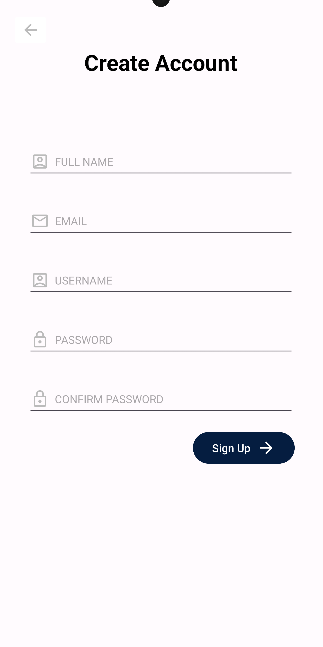
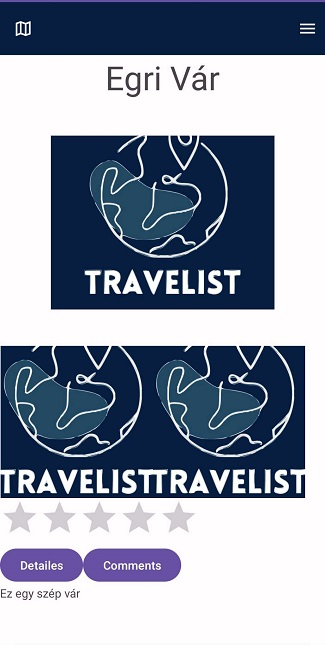

# Travelist – Turista Applikáció

A Travelist egy turista applikáció, melyet az új helyet felfedezni vágyók használhatnak új helyek, más emberek véleményének megismerésére. A felhasználók meg tudják osztani a saját tapasztalataikat is egy adott helyről, képek és szöveges leírások formájában is.

Ezen felül az applikációban lehetőség van valós idejű nyomonkövetésre és segítségkérésre is. A hely alapú ajánlások segítik majd a felhasználókat, hogy a hozzájuk közel eső helyszínek közül könnyebben válasszanak úticélt. 

## Mobil applikáció
A mobil applikáció  az elindítása után egyből engedélyt kér arra, hogy hozzáférjen a helyzetünkhöz.

Miután ezt engedélyeztük, lehetőség van bejelentkezni, illetve ha még nincs fiókunk, akkor regisztrálni.

Ezután megjelenik az alkalmazás menüje, ahonnan kiválaszthatja a felhasználó, hogy milyen műveletet szeretne végezni. Minden oldalról a jobb felső sarokban lévő menü ikonra kattintva visszatérhetünk a lehetőségek listájához.

A jobb alsó sarokban lévő beállítások ikonra kattintva módosíthatjuk, hogy milyen időközönként frissüljön a helyzetünk, illetve beállíthatjuk, hogy az applikáció jegyezze meg a bejelentkezéshez használt email-címünket.

Ha a menüből a Profile opciót választjuk, megtekinthetjük a profilunkat, módosíthatjuk a felhasználónevünket és a profilképünket. Tölthetünk fel a galériánkból is képet, illetve a kamerát is használhatjuk erre a célra.

A menüből a Search opciót választva megjelennek a térképen a már elmentett helyek, amelyekről adatokat tárolunk. Egy legördülő menüből kiválaszthatjuk, hogy mely város helyszíneit jelenítse meg a térkép. Ha valamelyik térkép markerre ráklikkelünk, megjelenik fölötte az adott hely neve. Ha pedig erre a névre nyomunk rá, megjelenik egy részletesebb nézet a helyszínről, ahol megtekinthetjük az erről feltöltött képeket, leírást, és a hely értékelését.

Ha a képeket szeretnénk nagyobb méretben megnézni, akkor bármelyik fotóra kattintva egy részletesebb nézettel találjuk szemben magunkat, ahol görgetni tudunk a képek között.

Ha valamelyik helyről meg szeretnénk nézi a mások által írt kommenteket, vagy mi magunk is szeretnénk megjegyzést hozzáfűzni, akkor a Comments gombra kell kattintanunk. Itt láthatjuk, hogy melyik felhasználó milyen megjegyzést írt, hanyasra értékelte a helyszínt. A New Comment gomb megnyomása után egy dialógusablakba írhatjuk be a saját véleményünk, értékelésünk. A Details gombra kattintva visszanavigálunk a hely részletes nézetére.

A Recommended For You opcióra klikkelve a menüben egy RecyclerView-ban megjelennek a számunkra ajánlott helyek.

Alapértelmezetten 7,5 kilométeres körzetből ajánl az app helyeket, viszont ezt a távolságot könnyen módosíthatjuk a Modify distance gombra kattintva. Ekkor egy DialogFragment-tel változtatni tudjuk ezt az értéket.

Ha a menüből a Track Others opciót választjuk, akkor megtekinthetjük a térképen az 5 kilométeres körzetünkben lévő felhasználók helyzetét. Alapértelmezetten a felhasználók markerei kékek, viszont ha valaki a Request Help megnyomásával segítséget kért, akkor ő ezen a térképen pirossal fog megjelenni.

Az Upload New Place opciót választva feltölthetünk egy új helyről értékelést, képeket, leírást. A térkép ikonra kattintva az applikáció behoz egy térképet, ahol ki tudjuk választani a feltölteni kívánt hely pontos helyzetét. Ha ezután megnyomjuk a képernyő alján található másolás gombot, akkor beilleszti a szélességi és hosszúsági koordinátákat a megfelelő szövegdobozba. Képet itt is tölthetünk fel a galéránkból, vagy készíthetjük őket egyenesen a kameránkkal.

A Request Help opciót választva pedig segítséget kérhetünk a közelünkben lévőktől. A képernyő tetején lévő gombot kell csupán megnyomni ehhez. Minden felhasználónál megjelenik ekkor ezen a képernyőn az általunk írt üzenet.
Ha jeleztük, hogy segítséget szeretnénk kérni, akkor megjelenik egy "I got help" nevű gomb. Ha megoldódik a problémánk, akkor ezt megnyomva eltűnik az üzenetünk.

