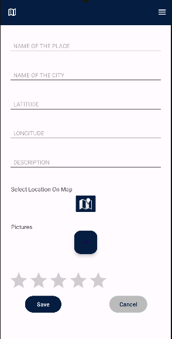

# Travelist – Turista Applikáció

A Travelist egy turista applikáció, melyet az új helyet felfedezni vágyók használhatnak új helyek, más emberek véleményének megismerésére. A felhasználók meg tudják osztani a saját tapasztalataikat is egy adott helyről, képek és szöveges leírások formájában is.

Ezen felül az applikációban lehetőség van valós idejű nyomonkövetésre és segítségkérésre is. A hely alapú ajánlások segítik majd a felhasználókat, hogy a hozzájuk közel eső helyszínek közül könnyebben válasszanak úticélt. 

## Mobil applikáció
A mobil applikáció  az elindítása után egyből engedélyt kér arra, hogy hozzáférjen a helyzetünkhöz.

Miután ezt engedélyeztük, lehetőség van bejelentkezni, illetve ha még nincs fiókunk, akkor regisztrálni.

Ezután megjelenik az alkalmazás menüje, ahonnan kiválaszthatja a felhasználó, hogy milyen műveletet szeretne végezni. Minden oldalról a jobb felső sarokban lévő menü ikonra kattintva visszatérhetünk a lehetőségek listájához.

A jobb alsó sarokban lévő beállítások ikonra kattintva módosíthatjuk, hogy milyen időközönként frissüljön a helyzetünk.

Ha a menüből a Profile opciót választjuk, megtekinthetjük a profilunkat, módosíthatjuk a felhasználónevünket és a profilképünket.

A menüből a Search opciót választva megjelennek a térképen a már elmentett helyek, amelyekről adatokat tárolunk. Egy legördülő menüből kiválaszthatjuk, hogy mely város helyszíneit jelenítse meg a térkép.

A Recommended For You opcióra klikkelve a menüben egy RecyclerView-ban megjelennek a számunkra ajánlott helyek.

Alapértelmezetten 7,5 kilométeres körzetből ajánl az app helyeket, viszont ezt a távolságot könnyen módosíthatjuk a Modify distance gombra kattintva. Ekkor egy DialogFragment-tel változtatni tudjuk ezt az értéket.

Ha valamelyik helyről részletesebb információkat szeretnénk kapni, akkor a helyhez tartozó Details gombra kell kattintanunk. Ezután megjelennek a helyszínről készült képek, nyitvatartási idő, elérhetőség, leírás.

Ha a képeket szeretnénk nagyobb méretben megnézni, akkor bármelyik fotóra kattintva egy részletesebb nézettel találjuk szemben magunkat, ahol görgetni tudunk a képek között.

Ha a menüből a Track Others opciót választjuk, akkor megtekinthetjük a térképen az 5 kilométeres körzetünkben lévő felhasználók helyzetét.

Az Upload New Place opciót választva feltölthetünk egy új helyről értékelést, képeket, leírást.

A Request Help opciót választva pedig segítséget kérhetünk a közelünkben lévőktől, akik ekkor egy értesítést kapnak. A képernyő közepén lévő nagy gombot kell csupán megnyomni ehhez.

